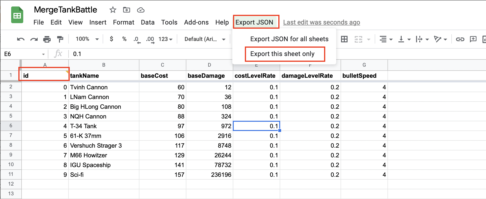
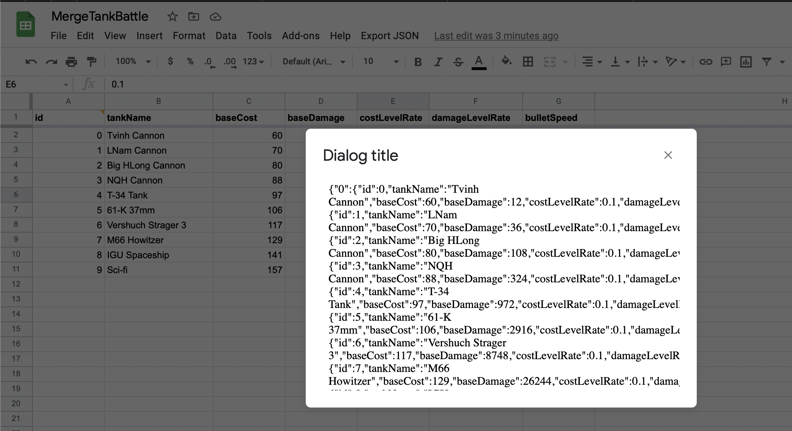
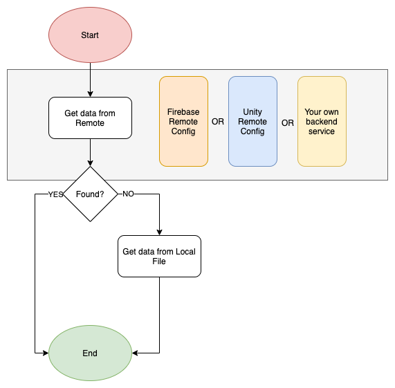
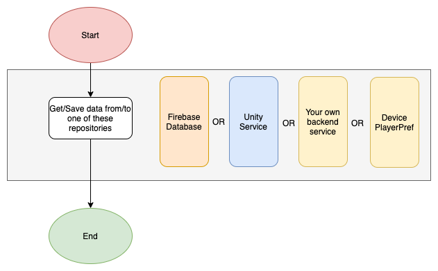

# Realbiz Games Data
  
In Realbiz Games, we divide data into 2 types as I listed below:
1. Master Data
2. User Playing Data
  
***Master Data:*** is the data that we define to balance/define the game for users. We usually use GoogleSheet to design these data. Google Sheet has many advantage to share and work together.  
***User Playing Data:*** is the data that is generated when the user playing the game. It can be user score, user selected theme, user level progress, etc.
  
As I have talked above, I can summarized:
1. Master Data: It is only read by the Application.
2. User Playing Data: It can be read and write by the Application.

## I. Master Data
  

***Step 1:*** Design master data. We use Google Sheet to design this type of data. Google Sheet is a good choice for sharing and work together. It is easy to integrate with our backend to run some productivity tasks.  
***Step 2:*** Export MasterData into json file that easy to work with development system. You can use [my-script](Tools~/google_sheet_export_json_tool_script.js) to do this job.  
***Step 3:*** Use this .json file as you want.  
  

  
#### How does our game read the MasterData?
  
The master data is read by the Unity Application follow the below diagram.
  

#### Where can you store your master data
1. Firebase Remote Config [More information](https://firebase.google.com/products/remote-config)
2. Firebase Cloud Storage [More information](https://firebase.google.com/docs/storage)
3. Unity Remote Config [More information](https://unity.com/remote-config)
4. Your Own Backend Service
5. Unity Game (Local)

## II. User Playing Data

